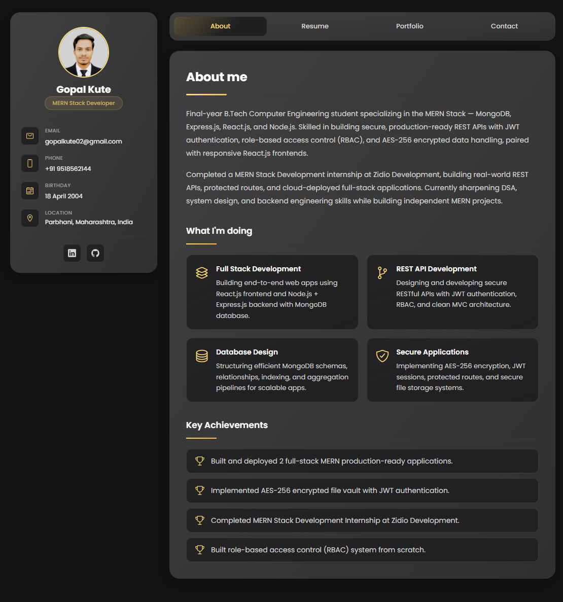
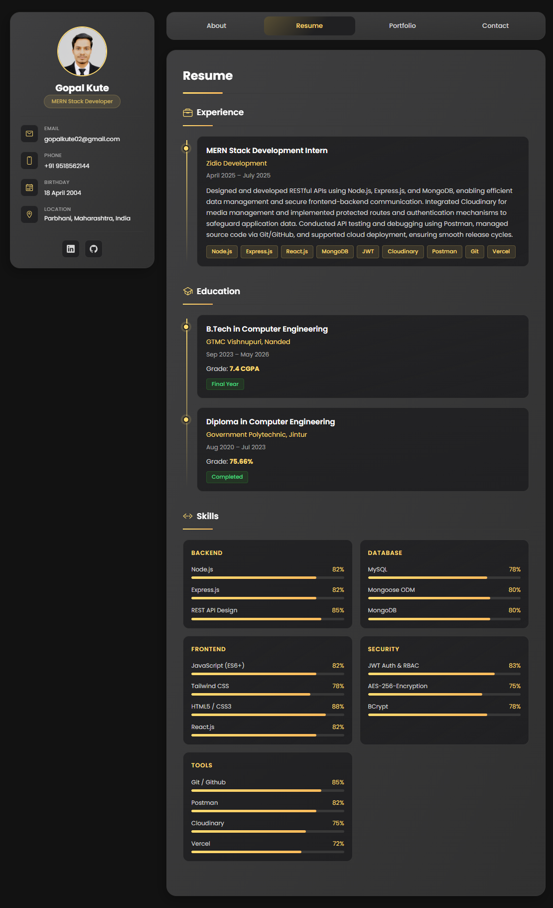
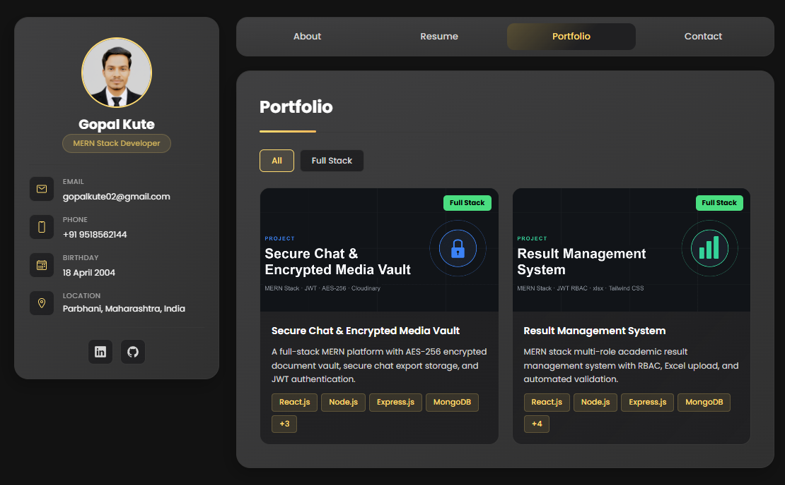
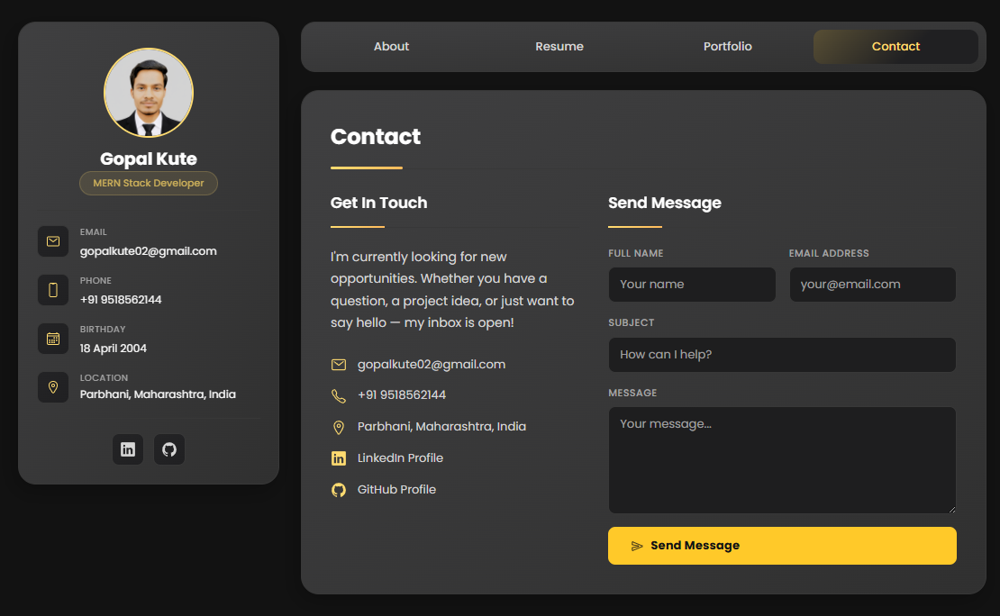
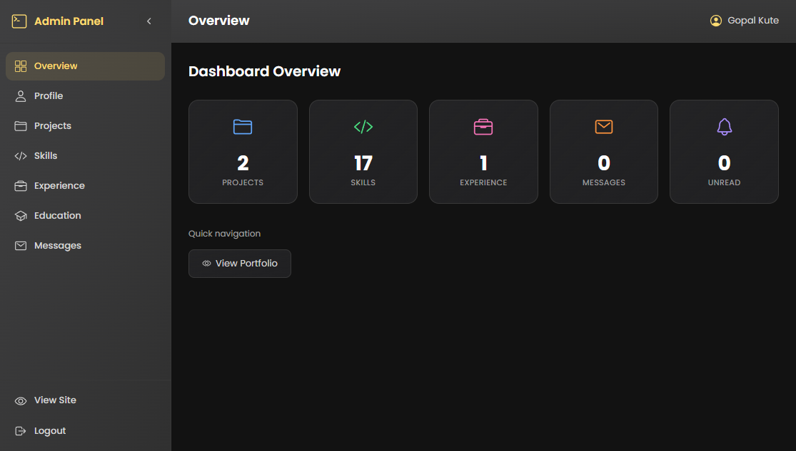
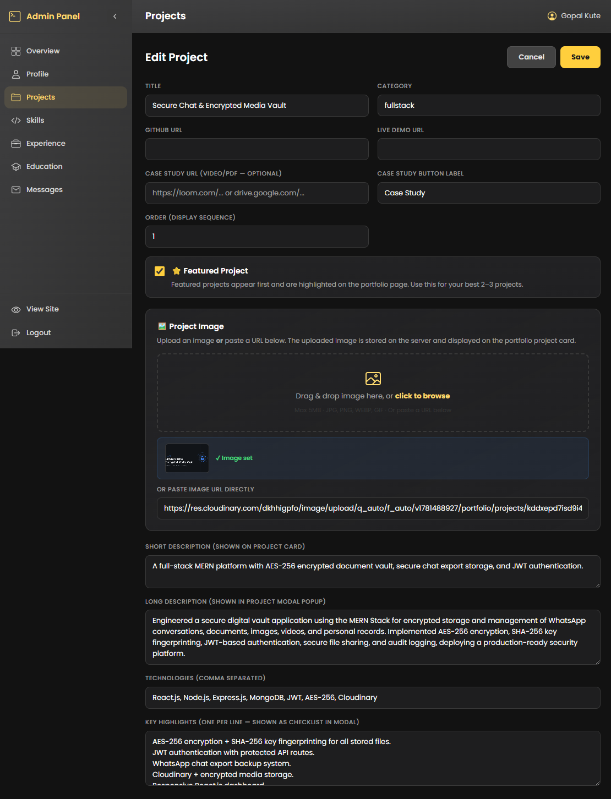

# 🚀 Gopal Kute — Developer Portfolio

A complete, production-ready **dynamic developer portfolio** built with the MERN Stack. Every section — projects, skills, experience, education, and profile — is managed live through a private admin dashboard. No code changes needed to update content.

---

## 📸 Features

| Feature                   | Description                                                                           |
| ------------------------- | ------------------------------------------------------------------------------------- |
| 👤 About                  | Bio, services with custom icon picker, key achievements                               |
| 📄 Resume                 | Experience & education timeline, skill progress bars, PDF download                    |
| 🗂️ Portfolio              | Filterable project cards, modal popups, GitHub / Live Demo / Case Study links         |
| 📬 Contact                | Message form saved to DB, LinkedIn / GitHub / LeetCode social links                   |
| 🔐 Admin Auth             | Private dashboard protected with JWT — `/admin/login`                                 |
| ✏️ Profile Editor         | Edit all personal info, social links, about text, services + icon picker              |
| 📁 Resume Upload          | Drag & drop PDF — old file auto-deleted from server on replace                        |
| 🖼️ Projects Manager       | Add / edit / delete projects with image upload, tech tags, highlights, case study URL |
| ⚡ Skills Manager         | Categorized skills with editable progress level bars                                  |
| 🏢 Experience & Education | Full CRUD for all timeline entries                                                    |
| 📥 Messages Inbox         | Read contact submissions, mark read/unread, one-click reply via email                 |
| 📱 Responsive             | Mobile, tablet, desktop — fully optimized at all breakpoints                          |
| 🌑 Dark Theme             | Professional dark UI with gold accent throughout                                      |

---

## 🛠️ Tech Stack

**Frontend:**


**Backend:**


---

## 📁 Folder Structure

```
gopal-portfolio/
│
├── package.json                    ← Root convenience scripts
├── setup.sh / setup.bat            ← One-click install scripts
│
├── backend/
│   ├── middleware/
│   │   └── auth.js                 ← JWT protect middleware
│   ├── models/
│   │   ├── Profile.js              ← Name, bio, social links, services, achievements
│   │   ├── Project.js              ← Title, category, image, tech, highlights, guide URL
│   │   ├── Skill.js                ← Category, name, level (0–100)
│   │   ├── Experience.js           ← Role, company, period, description, technologies
│   │   ├── Education.js            ← Degree, institution, period, grade
│   │   └── Message.js              ← Contact form submissions, read status
│   ├── routes/
│   │   ├── auth.js                 ← POST /login, POST /verify
│   │   ├── profile.js              ← GET / PUT
│   │   ├── projects.js             ← Full CRUD
│   │   ├── skills.js               ← Full CRUD
│   │   ├── experience.js           ← Full CRUD
│   │   ├── education.js            ← Full CRUD
│   │   ├── messages.js             ← POST (public), GET/DELETE/PATCH (admin)
│   │   └── upload.js               ← Image + PDF upload, auto-cleanup
│   ├── uploads/                    ← Stored files (auto-created on first run)
│   ├── server.js                   ← Entry point — connects DB, seeds data
│   ├── .env
│   ├── .env.example
│   └── package.json
│
└── frontend/
    ├── public/
    │   └── assets/images/          ← Static project thumbnail images
    ├── src/
    │   ├── context/
    │   │   └── AuthContext.jsx     ← JWT auth state, persists on refresh
    │   ├── pages/
    │   │   ├── Portfolio.jsx       ← Public: About / Resume / Portfolio / Contact tabs
    │   │   ├── Portfolio.css
    │   │   ├── AdminLogin.jsx      ← /admin/login
    │   │   ├── AdminLogin.css
    │   │   ├── AdminDashboard.jsx  ← Full admin panel (7 sections)
    │   │   └── AdminDashboard.css
    │   ├── utils/
    │   │   └── api.js              ← Axios instance with JWT interceptor
    │   ├── App.jsx                 ← Routes: / and /admin/*
    │   ├── App.css                 ← Global tokens, base styles
    │   └── main.jsx
    ├── index.html
    ├── vite.config.js              ← Dev proxy → backend :5000
    └── package.json
```

---

## 🚀 Quick Start

### Prerequisites

- Node.js v18+ ([download](https://nodejs.org))
- MongoDB v6+ locally **or** a [MongoDB Atlas](https://www.mongodb.com/atlas) URI
- npm v9+

---

### Step 1 — Clone / Extract

```bash
git clone https://github.com/gopalkute/gopal-portfolio.git
cd gopal-portfolio
```

---

### Step 2 — Configure Environment

**Backend** — create `backend/.env`:

```env
PORT=5000
MONGODB_URI=mongodb://127.0.0.1:27017/gopal_portfolio
JWT_SECRET=change_this_to_a_long_random_string
ADMIN_USERNAME=gopal
ADMIN_PASSWORD=admin123
NODE_ENV=development
CLOUDINARY_CLOUD_NAME=your_cloud_name 
CLOUDINARY_API_KEY=your_api_key 
CLOUDINARY_API_SECRET=your_api_secret 
SELF_URL=
```

**Frontend** — create `frontend/.env`:

```env
VITE_API_URL=http://localhost:5000/api
```

> ⚠️ Change `JWT_SECRET`, `ADMIN_USERNAME`, and `ADMIN_PASSWORD` before deploying.

---

### Step 3 — Install Dependencies

```bash
# Backend
cd backend && npm install

# Frontend (new terminal)
cd frontend && npm install
```

---

### Step 4 — Run the Application

```bash
# Terminal 1 — Backend
cd backend && npm start
# → http://localhost:5000

# Terminal 2 — Frontend
cd frontend && npm run dev
# → http://localhost:3000
```

---

## 🔐 Admin Access

| URL                                 | Username | Password   |
| ----------------------------------- | -------- | ---------- |
| `http://localhost:3000/admin/login` | `gopal`  | `admin123` |

> Change these in `backend/.env` before going live.

---

## 📋 API Reference

### Public Endpoints

| Method | Endpoint          | Description         |
| ------ | ----------------- | ------------------- |
| `GET`  | `/api/profile`    | Get profile data    |
| `GET`  | `/api/projects`   | Get all projects    |
| `GET`  | `/api/skills`     | Get all skills      |
| `GET`  | `/api/experience` | Get experience list |
| `GET`  | `/api/education`  | Get education list  |
| `POST` | `/api/messages`   | Submit contact form |

### Admin Endpoints

All admin routes require the `Authorization` header:

```
Authorization: Bearer <your_jwt_token>
```

| Method   | Endpoint                 | Description                          |
| -------- | ------------------------ | ------------------------------------ |
| `POST`   | `/api/auth/login`        | Login — returns JWT                  |
| `POST`   | `/api/auth/verify`       | Verify token validity                |
| `PUT`    | `/api/profile`           | Update profile                       |
| `POST`   | `/api/projects`          | Create project                       |
| `PUT`    | `/api/projects/:id`      | Update project                       |
| `DELETE` | `/api/projects/:id`      | Delete project                       |
| `POST`   | `/api/skills`            | Add skill                            |
| `PUT`    | `/api/skills/:id`        | Update skill                         |
| `DELETE` | `/api/skills/:id`        | Delete skill                         |
| `POST`   | `/api/experience`        | Add experience                       |
| `PUT`    | `/api/experience/:id`    | Update experience                    |
| `DELETE` | `/api/experience/:id`    | Delete experience                    |
| `POST`   | `/api/education`         | Add education                        |
| `PUT`    | `/api/education/:id`     | Update education                     |
| `DELETE` | `/api/education/:id`     | Delete education                     |
| `GET`    | `/api/messages`          | Get all messages                     |
| `PATCH`  | `/api/messages/:id/read` | Mark message as read                 |
| `DELETE` | `/api/messages/:id`      | Delete message                       |
| `POST`   | `/api/upload/image`      | Upload project image (JPG/PNG/WEBP)  |
| `POST`   | `/api/upload/resume`     | Upload resume PDF — auto-deletes old |

---

## 🗄️ Database Schema

### Profile Collection

```js
{
  name:        String,    // display name
  title:       String,    // e.g. "MERN Stack Developer"
  subtitle:    String,
  email:       String,
  phone:       String,
  location:    String,
  birthday:    String,
  cgpa:        String,
  linkedin:    String,
  github:      String,
  leetcode:    String,
  avatar:      String,    // URL
  resumeUrl:   String,    // uploaded PDF URL
  about:       [String],  // array of paragraphs
  services:    [{ title, description, icon }],
  achievements:[String]
}
```

### Project Collection

```js
{
  title:           String,   // required
  category:        String,   // fullstack | backend | frontend | ai | other
  description:     String,   // short — shown on card
  longDescription: String,   // full — shown in modal
  technologies:    [String],
  image:           String,   // URL or /uploads/filename
  github:          String,
  live:            String,
  guideUrl:        String,   // case study / video / PDF link
  guideLabel:      String,   // "Case Study" | "Watch Demo" | etc.
  featured:        Boolean,  // default: false
  order:           Number,   // display sequence
  highlights:      [String]  // checklist in modal
}
```

### Skill Collection

```js
{
  category: String,   // "Backend" | "Frontend" | "Database" etc.
  name:     String,   // e.g. "React.js"
  level:    Number,   // 0–100 (shown as progress bar)
  order:    Number
}
```

### Message Collection

```js
{
  name:      String,   // required
  email:     String,   // required
  subject:   String,
  message:   String,   // required
  read:      Boolean,  // default: false
  createdAt: Date
}
```

---

## 🖼️ Screenshots

| Portfolio — About | Portfolio — Resume |
| ----------------- | ------------------ |
|    |     |

| Portfolio — Projects | Portfolio — Contact |
| -------------------- | ------------------- |
|       |      |

| Admin — Dashboard Overview | Admin — Projects Editor |
| -------------------------- | ----------------------- |
|     |  |

---

## 🌐 Live Demo

> 🔗 **[CLICK ME - Live Portfolio](https://gopalkute.vercel.app)**

---

## 🚢 Deployment

### Backend — Render / Railway

1. Push `backend/` to a GitHub repository
2. Create a new **Web Service** on [Render](https://render.com)
3. Set root directory to `backend/`
4. Build command: `npm install`
5. Start command: `node server.js`
6. Add all environment variables from `backend/.env`
7. Set `MONGODB_URI` to your [MongoDB Atlas](https://cloud.mongodb.com) connection string
8. Set `NODE_ENV=production`

### Frontend — Vercel

1. Push `frontend/` to a GitHub repository
2. Import project on [Vercel](https://vercel.com)
3. Set root directory to `frontend/`
4. Build command: `npm run build`
5. Output directory: `dist`
6. Add environment variable: `VITE_API_URL=https://your-backend-url.com/api`

### Database — MongoDB Atlas

1. Create a free cluster at [mongodb.com/atlas](https://www.mongodb.com/atlas)
2. Whitelist your server IP (or `0.0.0.0/0` for development)
3. Copy the connection string into `MONGODB_URI`

---

## 🔒 Security

- **JWT** — stateless authentication, 7-day expiry
- **bcryptjs** — password hashing for admin credentials
- **CORS** — restricted to frontend origin
- **Protected routes** — all admin API routes require Bearer token
- **File validation** — upload routes check MIME type and file size before saving
- **Auto-cleanup** — old resume PDF deleted from disk when new one is uploaded

---

## 📝 Environment Variables Reference

### backend/.env

```env
PORT=5000
MONGODB_URI=mongodb://127.0.0.1:27017/gopal_portfolio
JWT_SECRET=your_super_long_secret_key_here
ADMIN_USERNAME=gopal
ADMIN_PASSWORD=admin123
NODE_ENV=development
CLOUDINARY_CLOUD_NAME=your_cloud_name 
CLOUDINARY_API_KEY=your_api_key 
CLOUDINARY_API_SECRET=your_api_secret
SELF_URL=
```

### frontend/.env

```env
VITE_API_URL=http://localhost:5000/api
```

---

## 👨‍💻 Author

**Gopal Kute**
Final Year B.Tech Computer Engineering · MERN Stack Developer

[](https://linkedin.com/in/gopalkute)
[](https://github.com/gopalkute)
[](https://leetcode.com/gopalkute)

---

## 📄 License

MIT — free to use for personal and commercial projects.

---

Built with ❤️ using the MERN Stack
